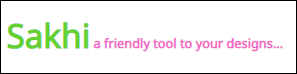
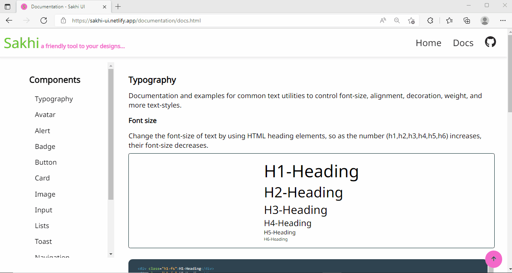

<div align="center">



# SAKHI UI

Sakhi UI is a CSS component library, which acts like a helping hand in building your projects with ease by providing you list of components which are ready to use and customize as per your taste.

[](https://app.netlify.com/sites/sakhi-ui/deploys)

</div>

---

## Installation Guide

To start using the components in your project, Use CSS styles with ease, just by coping the link given below and paste it in the `<head>`  tag of your html file.

```html
    <link rel="stylesheet" href="https://sakhi-ui.netlify.app/Components/components.css">;
```   

### SAKHI UI contains the following components

- [Typography](#typography)
- [Avatar](#avatar)
- [Alert](#alert)
- [Badge](#badge)
- [Button](#button)
- [Card](#card)
- [Image](#image)
- [Input](#input)
- [Lists](#lists)
- [Toast](#toast)
- [Navigation](#navigation)
- [Slider](#slider)
- [Rating](#rating)
- [Modal](#modal)
- [Grid-Simplified](#grid-simplified)

---

<div align="center">

Have a look at the Website of Sakhi UI.

</div>



---
### week three assignment (added remaining components in CL and added favicon,scroll to top icon in each page)
### Rating

Ratings provide insight regarding others opinions and experiences, and also allow the user to submit a rating of their own. Ratings used in E-commerce sites.

Find the following types of *Rating* on https://sakhi-ui.netlify.app/components/rating/rating

- Basic Rating
- customizing the rating component.

---
### Modal

The modal component provides a solid foundation for creating dialogs, popovers, lightboxes or whatever else , which displays content that temporarily blocks interactions with the main view of a site.

Find the following types of *Modal* on https://sakhi-ui.netlify.app/components/modal/modal

- Simple Modal
- Modal demo

---
### Grid-Simplified

Grids are 2D(two-dimensional), it's represented in rows and columns.It's a powerful property which controls complex layouts on screen in a magically way and which is maintainable and easy to use.

Find the following types of *Grid* on https://sakhi-ui.netlify.app/components/grid-simplified/simplified-grid

- Grid-2: two items in a grid
- Grid-3: three items
- Responsive Grids.

---

### Toast
- Functional Baseline Toast

---

### Navigation

A navigation bar is a user interface element within a webpage that contains links to other sections of the website.

Find the following types of *Navigation* on https://sakhi-ui.netlify.app/components/navigation/navigation

- Navigation - Submenus
- Mobile navigation bar with Hamburger
