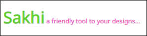

<div align="center">



# SAKHI UI

Sakhi is a CSS component library, which acts like a helping hand in building your projects with ease by providing you list of components which are ready to use and customize as per your taste.

[](https://app.netlify.com/sites/sakhi-ui/deploys)

</div>

---

## Installation Guide

To start using the components in your project, Use CSS styles with ease, just by coping the link given below and paste it in the `<head>`  tag of your html file or import in css file.

```html
    <link rel="stylesheet" href="https://sakhi-ui.netlify.app/Components/components.css">;
```   

### SAKHI UI contains the following components

- [Typography](#typography)
- [Avatar](#avatar)
- [Alert](#alert)
- [Badge](#badge)
- [Button](#button)
- [Card](#card)
- [Image](#image)
- [Input](#input)
- [Lists](#lists)
- [Toast](#toast)

---

### Typography

Typography is the art of arranging letters and text.

Find the following types of *text-utilities* on https://sakhi-ui.netlify.app/components/typography/typography

- Headings
- Text-alignments
- Text-Decoration
- gray text
- small text
- mark and font-weight

---

### Avatar

Avatar can be used to show user's profile picture on profile information page.

Find the following types of *Avatar* on https://sakhi-ui.netlify.app/components/avatar/avatar

- Image Avatars with different shapes and sizes.
- Text Avatars with differnt sizes.

---

### Alert

Alert is used to grab user attention quickly for important message to display.

Find the following types of *Alert* on https://sakhi-ui.netlify.app/components/alert/alert

- Primary Alert
- Secondary Alert
- Success Alert
- Warning Alert
- Error Alert
- Simple alerts without close button
- Alerts with icon and close button
- Alerts with outline and icon


---

### Badge

Badge can be used to show either status of the user (online, or offline) or you can use it show notification count.

Find the following types of *Badge* on https://sakhi-ui.netlify.app/components/badge/badge

- Badge on Text
- Badge on Icon
- Badge on Buttons
- Badge on Avatars

---

### Button

Buttons are really diverse and can serve plenty of purposes.Buttons are one of the main component in a interactive Web Application. Buttons allow users to take actions with a single tap.

Find the following types of *Button* on https://sakhi-ui.netlify.app/components/button/button

- Solid Buttons
- Outlined Buttons
- Link Buttons
- Icon Buttons
- Floating Buttons

---

### Card

Cards are a convenient means of displaying content composed of different types of objects. You can use them to display content on an e-commerce app, or on a video library app. You can also use them to show user feedback in the form of text-only card on your site.

Find the following types of *Card* on https://sakhi-ui.netlify.app/components/card/card

- Cards with badges
- Cards with dismiss
- Cards with text overlay
- Text only cards
- Vertical/Horizontal cards
- Cards with shadow

---

### Image

Image can be used to display large picture on the website.

Find the following types of *Image* on https://sakhi-ui.netlify.app/components/image/image

- Round Image
- Responsive Image

---

### Input

Inputs are necessary for user interaction with the website.

Find the following types of *Input* on https://sakhi-ui.netlify.app/components/input/input

- Textbox
- with validation and errors style

---

### Lists

List is used to group related content in any component.

Find the following types of *Lists* on https://sakhi-ui.netlify.app/components/lists/lists

- Ordered List,un-ordered List ,reverse order list , list with bullets and no-bullets.
- Notification Stacked List.

---

### Toast

Toast is mostly used to show quick messages on process after some actions took place in application.

Find the following types of *Toasts* on https://sakhi-ui.netlify.app/components/toast/toast

- Simple toast
- Error toast
- Success toast
- warning toast
- 
---

<div align="center">

Have a look at the Website of Sakhi UI.

</div>


---
